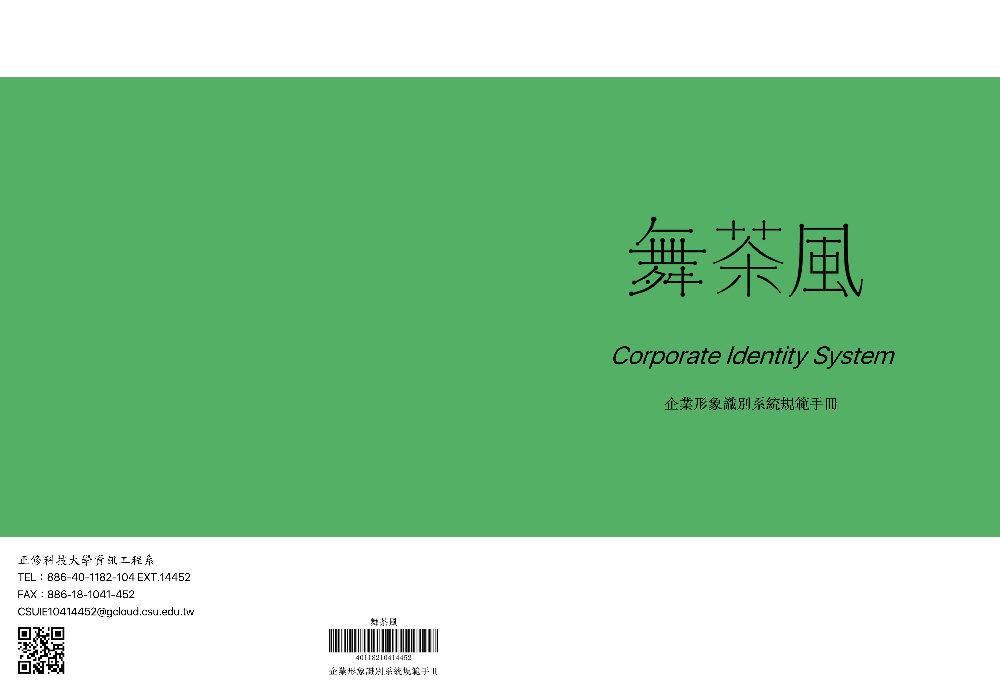

Corporate_Identity_System_WCF
======
## learning CIS, draw logo(set size, color, meaning), color plan, print, specifies rule.
## Introduction：
- 1.May be you can look image or download pdf. Because it most clearly the easiest to understand

##Peripheral products：
- 1.We created web page for corporate. http://goo.gl/JSO6OI .The web page can support any device any size.(Use Bootstrap), so if you are interested, you can scan to QRCode.

                            

###Process Steps：

- 1.Select a corporate.
- 2.Understand the corporate.(Questionnaire)
- 3.Start making

##Logo
===============

##Front cover
===============

This is me and my friend homework, we are maked together.
